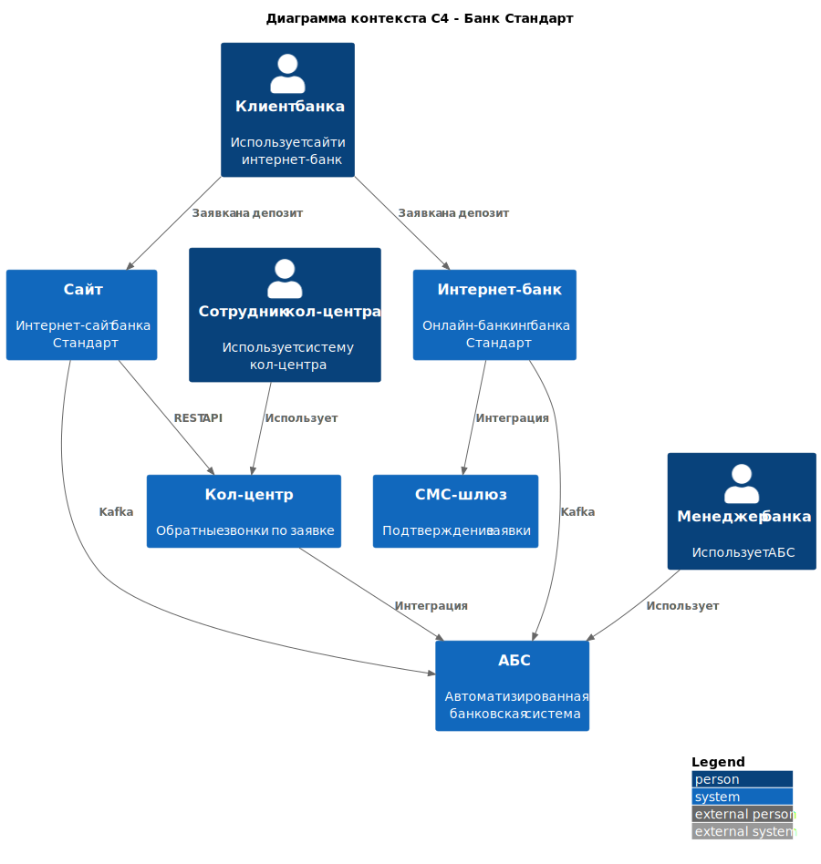
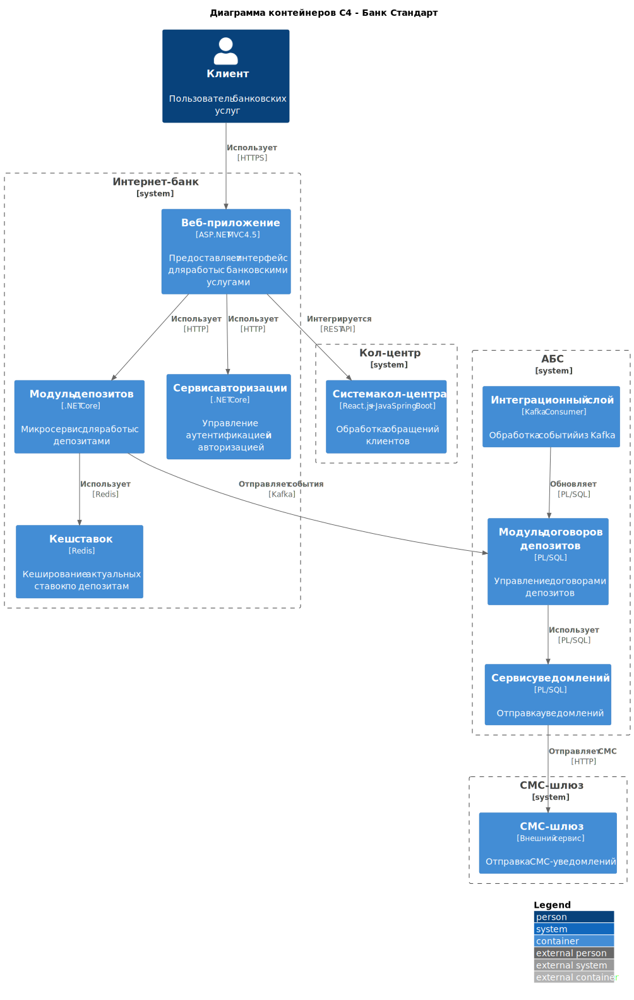

# Задание 3. ADR-1

### **Название задачи:**  
[ADR-1] Реализация MVP цифрового открытия депозитов через интернет-банк и сайт  

### **Автор:**  
Команда цифровой трансформации розничного бизнеса

### **Дата:**  
16.05.2025

---

### **Функциональные требования**  

|**№**|**Действующие лица или системы**|**Use Case**|**Описание**|
| :-: | :- | :- | :- |
| 1 | Клиент, Сайт | Подача заявки на депозит через сайт | 1. Клиент выбирает депозит на сайте 2. Вводит ФИО и телефон 3. Система шифрует данные и передаёт в кол-центр 4. Менеджер кол-центра связывается для уточнения условий |
| 2 | Клиент, Интернет-банк | Подача заявки через интернет-банк | 1. Авторизованный клиент выбирает депозит 2. Указывает сумму и счёт списания 3. Подтверждает операцию SMS-кодом 4. Заявка передаётся в бэк-офис |
| 3 | Бэк-офис, АБС | Обработка заявки | 1. Менеджер бэк-офиса проверяет заявку 2. Вводит данные в АБС 3. АБС генерирует договор 4. Система отправляет уведомление клиенту |
| 4 | АБС, СМС-шлюз | Уведомление клиента | 1. АБС отправляет событие об открытии депозита 2. СМС-шлюз рассылает клиенту подтверждение |

---

### **Нефункциональные требования**  

|**№**|**Требование**|
| :-: | :- |
| 1 | Время ответа интерфейсов <500 мс |
| 2 | Шифрование данных TLS 1.3+ для сайта и интернет-банка |
| 3 | Горизонтальное масштабирование интернет-банка (Kubernetes) |
| 4 | Асинхронная интеграция с АБС через Kafka |
| 5 | Резервирование ЦОД с автоматическим failover |

---

### **Решение**  

#### Диаграммы C4:

##### Диаграмма контекста

##### Диаграмма контейнеров

**Логика выбора технологий:**  
- Использование Kafka для асинхронной коммуникации снижает нагрузку на АБС  
- Redis для кеширования ставок решает проблему медленных справочников  
- .NET Core выбран из-за экспертизы команды интернет-банка  

---

### **Альтернативы**  

**Вариант 1: Прямая интеграция с АБС через REST**  
- *Недостатки:* Риск перегрузки АБС, нарушение SLA  
- *Ограничения:* Требует изменения ядра АБС  

**Вариант 2: RabbitMQ вместо Kafka**  
- *Недостатки:* Нет поддержки долгосрочного хранения событий  
- *Риски:* Сложности масштабирования  

**Недостатки выбранного решения:**  
- Зависимость от команды АБС для настройки Kafka Consumer  
- Необходимость ручной обработки заявок на этапе MVP  

**Риски:**  
- Задержки из-за ручного ввода данных в АБС  
- Низкая производительность при пиковых нагрузках на кол-центр  