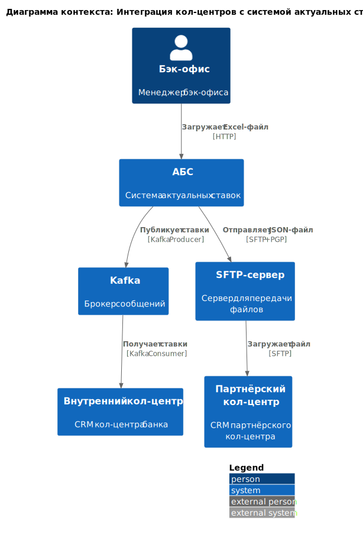
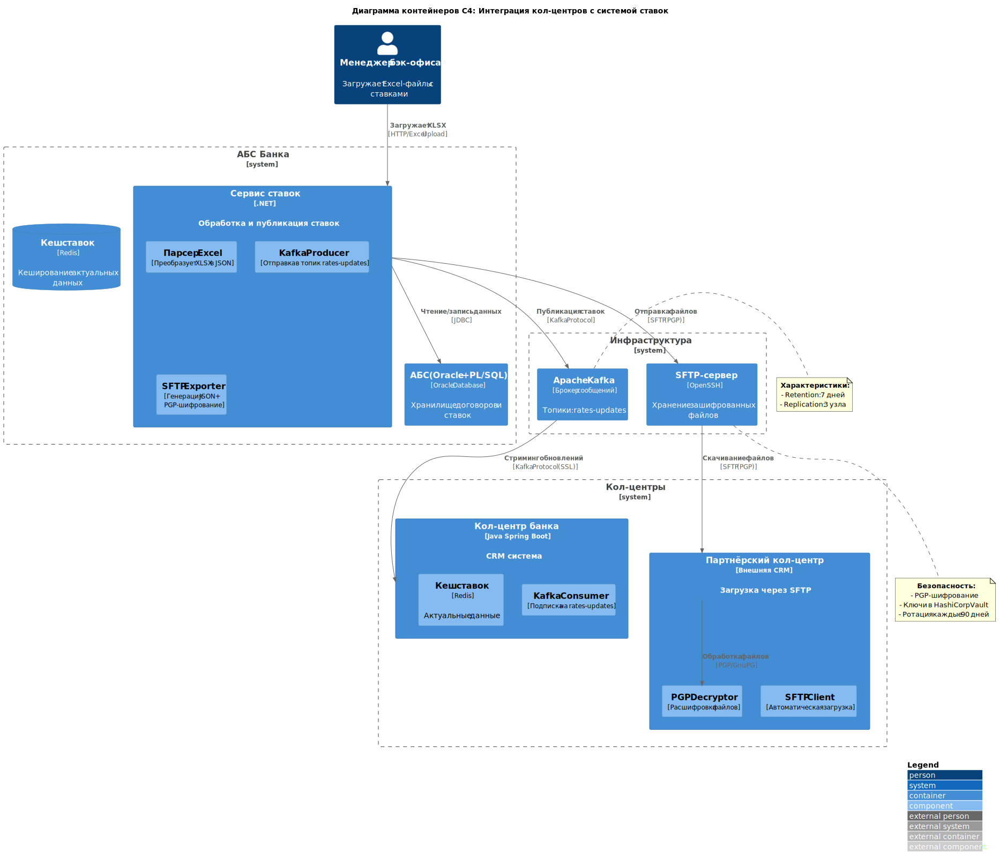

# Задание 4. ADR-2

### **Название задачи:**  
[ADR-2] Интеграция кол-центров с системой актуальных ставок  

### **Автор:**  
Команда цифровой трансформации розничного бизнеса

### **Дата:**  
16.05.2025

---

### **Функциональные требования**  

|**№**|**Действующие лица или системы**|**Use Case**|**Описание**|
| :-: | :- | :- | :- |
| 1 | Бэк-офис, АБС | Обновление ставок | 1. Менеджер бэк-офиса загружает Excel-файл в АБС 2. АБС валидирует данные 3. Система публикует ставки в Kafka |
| 2 | Кол-центр банка | Получение актуальных ставок | 1. CRM кол-центра подписывается на топик Kafka 2. Обновляет кеш ставок каждые 5 минут |
| 3 | Партнёрский кол-центр | Импорт ставок через SFTP | 1. АБС генерирует JSON-файл каждые 15 минут 2. Файл шифруется и отправляется на SFTP-сервер 3. Партнёр загружает файл в свою CRM |

---

### **Нефункциональные требования**  

|**№**|**Требование**|
| :-: | :- |
| 1 | Задержка обновления ставок ≤1 мин (для внутреннего кол-центра) |
| 2 | Шифрование PGP для SFTP-передач |
| 3 | Ротация ключей SFTP каждые 90 дней |
| 4 | Мониторинг целостности файлов (MD5-checksum) |

---

### **Решение**  

**Диаграммы C4:**  
##### Диаграмма контекста

##### Диаграмма контейнеров

### **Альтернативы**  

**Вариант 1: REST API для партнёра**  
- *Недостатки:* Требует изменений в инфраструктуре партнёра  
- *Риски:* Отказ партнёра от интеграции  

**Вариант 2: Использование Shared DB**  
- *Недостатки:* Нарушение изоляции систем  
- *Ограничения:* Нет поддержки в текущей АБС  

**Недостатки выбранного решения:**  
- Задержка до 15 минут для партнёрского кол-центра  
- Ручная загрузка Excel в АБС  

**Риски:**  
- Расхождение данных при ошибках в Excel-файле  
- Утечка ключей SFTP  

---

### **Список задач**  

| Система | Задачи | Срок | 
|---------|--------|------|
| АБС | Реализация Kafka Producer для ставок | 2 мес |  
| АБС | Разработка SFTP Exporter с PGP | 1.5 мес |  
| Кол-центр | Интеграция с Kafka Consumer | 1 мес |  
| Инфраструктура | Настройка SFTP-сервера | 3 нед |  
| Безопасность | Внедрение ротации ключей | 2 нед |  

---

### **RoadMap**  

**Годовая перспектива:**
- Автоматизация загрузки ставок из Risk-системы  
- Замена Excel на веб-интерфейс для бэк-офиса  